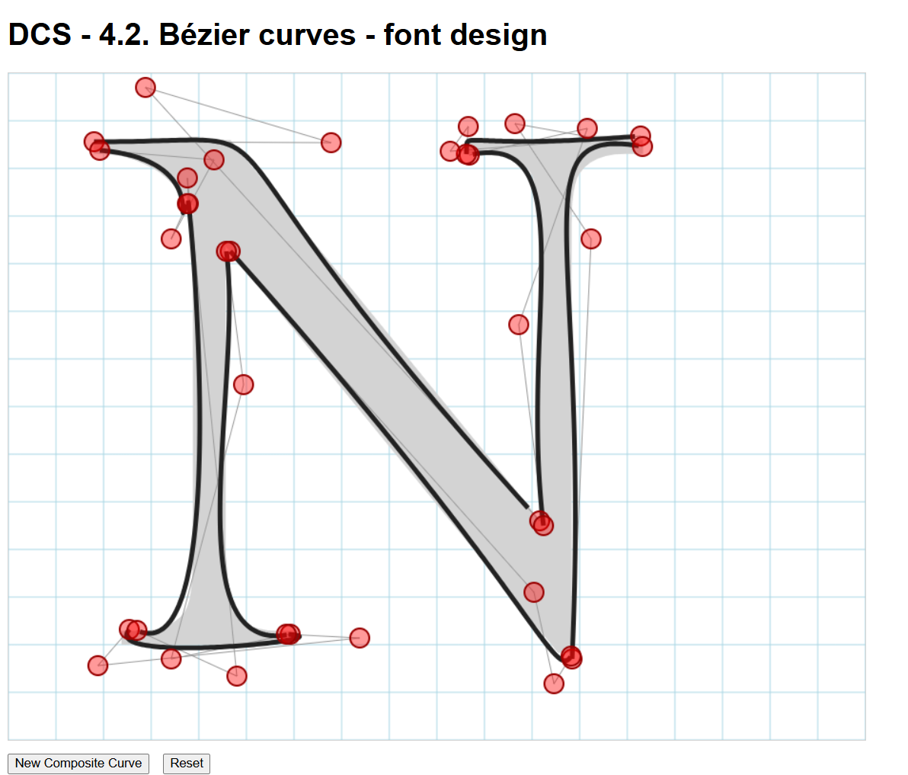
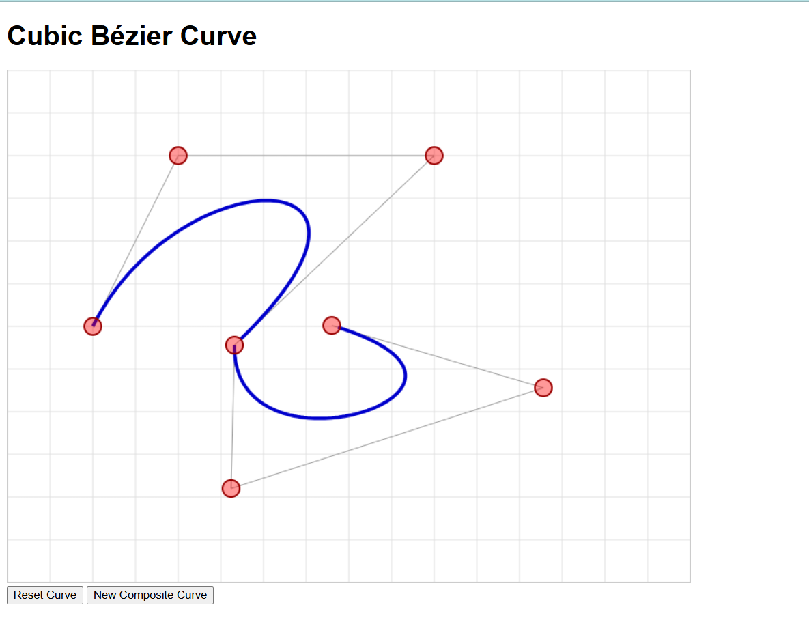
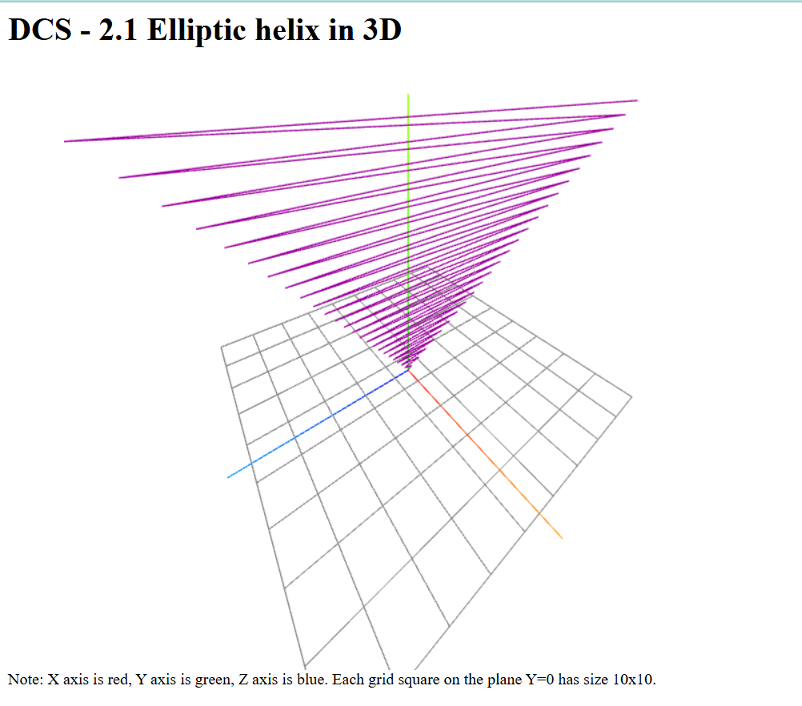
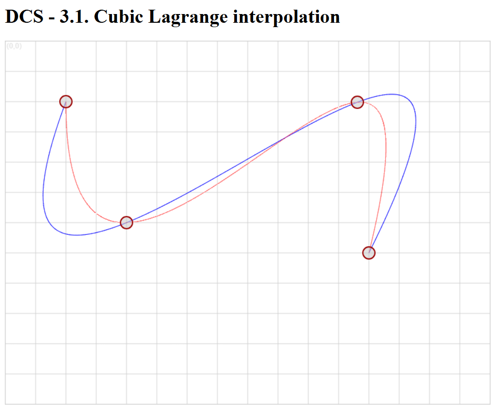
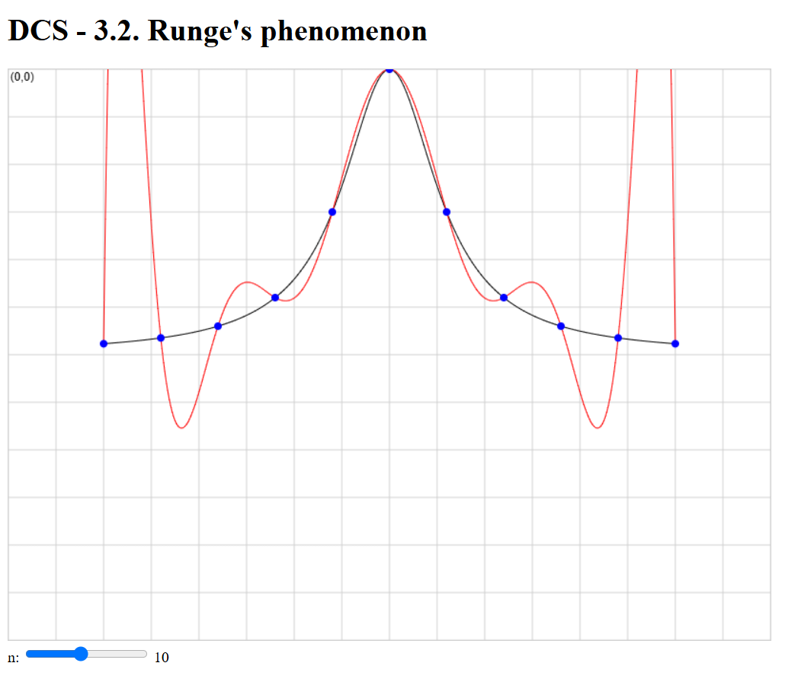
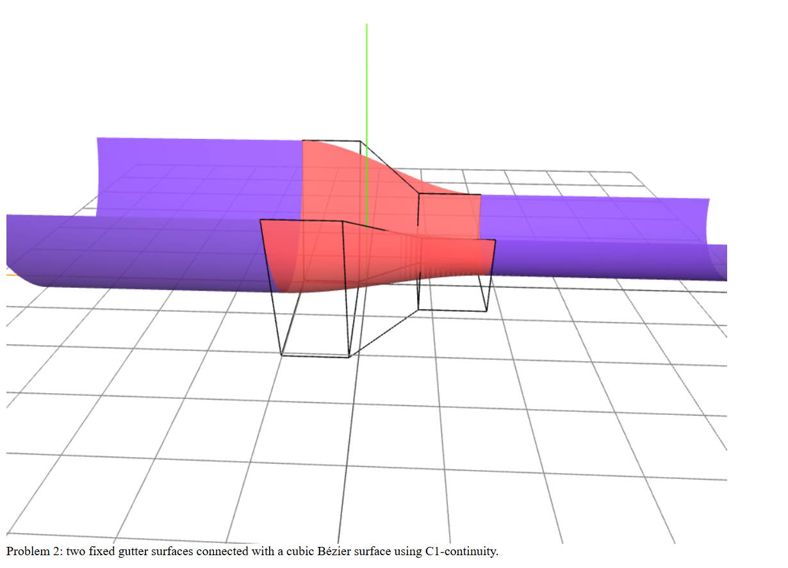

# Curves and Surface Design

Interactive implementations of curve interpolation, Bézier geometry and
parametric surface design using JavaScript, HTML Canvas and Three.js.

Developed as part of the Design of Curves and Surfaces course.

## Topics

### Curve Parametrization
- 3D elliptic helix
- Parametric curve visualization

### Interpolation
- Lagrange interpolation
- Uniform vs distance-based parametrization
- Runge's phenomenon
- Cubic Hermite interpolation

### Bézier Curves
- Cubic Bézier curves using de Casteljau's algorithm
- Interactive draggable control points
- Composite Bézier curves
- Bézier-based font design
- Import/export of control points

### Surface Design
- Tensor-product Bézier surfaces
- Parametric surfaces using Three.js
- Bézier control meshes
- C1-continuous surface connections

## Technologies

- JavaScript
- HTML5 Canvas
- Three.js
- Math.js
- Computational geometry

  ## Screenshots

### Bézier Design

  

### Cubic Bézier

  

### Elliptic Helix

  

### Lagrange Interpolation

  

### Runge's Phenomenon

  

### C1 Continuity

  

## Purpose

The project explores mathematical techniques used in computer graphics and
geometric modeling by implementing them as interactive visualizations.
